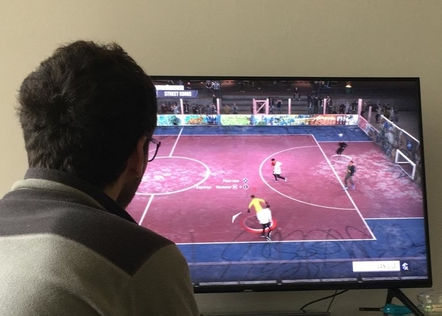

@title[what]

This talk is about communication and setting expectations

Note:

- So this talk is about communication and setting expectations.
- And I'd like to start with an example

---

@title[what]

How many times were you in the situation where your partner said:

@css[fragment](Can you take the trash out?)

---

You wanted to say yes, but you were in the middle of something important

---

---

So you said: @css[fragment](Sure, I'll do that later)

Note:

- This has many possible outcomes, but most of them are not good for you
- Let's just have a look a some possible ends for this story

---

You might just forget

@img[fragment](https://i.pinimg.com/474x/a9/5b/6f/a95b6fbbe2b0b97e9e3294b0c812ed0d--washington-dc-pictures-of.jpg)

Note:

- This is bad, look at the picture.
- And the face of your partner, that's scary
---

Or even worse...

@css[fragment](Your partner do it for you)

@img[fragment](http://www.notrashcan.com/wp-content/uploads/clean_inner_can.jpg)

Note:

- But it can get worse... what if your partner had to do it? had to do something that you said you would do.
- That's terrifying.
- so, consequences of this?

---

Your partner got disappointed and possibly stressed.

@css[fragment](So you got stressed)

---

Your partner had to do extra work which might have screwed up their entire schedule.

@css[fragment](DIRTY TOILET PLACEHOLDER)

Note:

- Your partner had to do extra work which might have screwed up their entire schedule.
- Imagine she was going to clean the toilet and could not do that because of the trash situation.
- I actually searched for "dirty toilet", but the images I got were too strong... use your imagination

---

Note:

- Maybe there were other consequences, like the trash now is piling up in the street because you did not take it out on time
- You could've been communicated about this if you had said that you will take a week to take the trash out.
- By this point you should be traumatized but you should also realise that this happens also at work.
- when you say "Sure, I'll do that" you leave a lot of room for things to go wrong

---

We say things like this all the time

@ul
- I think I can do this today.
- I’ll fix it as soon as possible
- I hope to finish it this week.
@ulend

Note:

- When we say these things we are kinda saying that something will happen, but also leaving a way out.
- Like well I did not say by when or I was hoping to do it but it was not possible.
- But you know, when you say I think I can do it today, there's someone that could be counting on it so we shouldn't be
taking it so lightly

---

Think your answer thoroughly.

@ul
- Are you really willing to do it?
- Are you able to do it?
- Does it depend on you?
- Do you have the time? And if you do, when?
@ulend

Note:

- So, first thing. If you are not going to do it, don't say you will.
- Think your answer thoroughly.
- Go with the list

---

Communicate **by** when you are going to do it.

@css[fragment](and mean it)

Note:

- Again, be thorough about this, don't say things because
- This also sets the expectations and gives the other person the opportunity of analizing other options.
In the example of the trash your partner could decide to take the trash out by themselves for example.
- Also, take into consideration that different cultures perceive time differently. Right now example.
- Do don't say things like right now, commit to a date.

---

F***ing do it.

@css[fragment](or raise a red flag)

Note:

- and of course, you said you'd do it so do it.
- and if for some reason you can't raise a red flag as soon as possible so people can adapt to the new situation

---

Commitment language

@css[fragment](I will do ... by ...)

Note:

- There's this thing called Commitment language, it is really simple
- It consist on saying things in this form
- there is some rules around it, like you can only commit to things that are under your control. meeting example
- and of course only commit to realistic or possible things. Sometimes is hard to know the difference
- there's a small chapter about this in the book Elastic Leadership so you can get more familiar with it. I really recommend it.
- but you know there's not much mistery. It is about of being responsible when communicating, being realistic and really commit to what you're saying.

---
